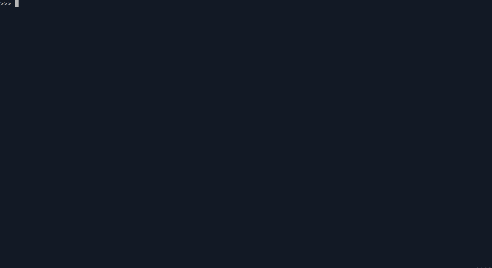

<h1>The Stack Abstract Data Type</h1>

A <strong>stack</strong> is an ordered collection of items where the addition of new items and the removal of existing items always takes place at the same end. The base of the stack is significant since items stored in the stack that are closer to the base represent those that have been in the stack longest. The most recently added item is the one that is in position to be removed first. This ordering principle is sometimes called <strong>LIFO</strong>, last-in first-out. It provides an ordering based on length of time in the collection. Stacks are fundamentally important, as they can be used to reverse the order of items. The order of insertion is the reverse of the order of removal.

<h1>Operations</h1>

<ul>
  <li><strong>Stack(  )</strong> - creates a new stack that is empty. It needs no parameters and returns an empty stack.

  <li><strong>push(item)</strong> - adds a new item to the top of the stack. It needs the item and returns nothing.

  <li><strong>pop(  )</strong> - removes the top item from the stack. It needs no parameters and returns the item. The stack is modified.

  <li><strong>peek(  )</strong> - returns the top item from the stack but does not remove it. It needs no parameters. The stack is not modified.

  <li><strong>is_empty(  )</strong> - tests to see whether the stack is empty. It needs no parameters and returns a boolean value.
</ul>

<h1>Implementation</h1>

<p>In object-oriented programming languages, the implementation of choice for an abstract data type such as a stack is the creation of a new class. The stack operations are implemented as methods. Further, to implement a stack, which is a collection of elements, it makes sense to utilize the power and simplicity of the primitive collections provided by Python. We will use a list.</p>

```python

class Stack:

    def __init__(self):
        self.items = []

    def is_empty(self):
        return self.items == []

    def push(self, item):
        self.items.append(item)

    def pop(self):
        return self.items.pop()

    def peek(self):
        return self.items[len(self.items) -1]

    def size(self):
        return len(self.items)

```

<h1>Example</h1>



<h1>Performance</h1>

<p>Big-O performance of the Python stack operations:</p>

[Insert information here]

<p></p>

<h1>Algorithms</h1>

<p>Here are a few algorithms that use stacks:</p>

<ul>
  <li><a href="contents/algorithms/balanced_parentheses">Balanced Parentheses</a>

  <li><a href="contents/algorithms/base_converter">Base Converter</a>

  <li><a href="contents/algorithms/rev_string">Reverse String</a>
</ul>

